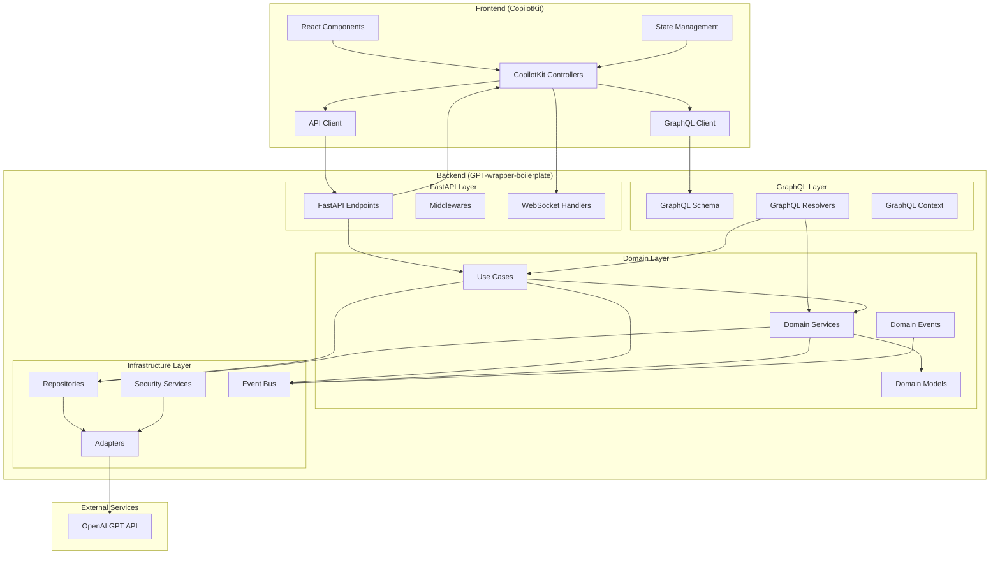

# CopilotKit Integration Architecture

This document outlines the architectural approach for integrating the CopilotKit frontend with the GPT-wrapper-boilerplate backend.

## Architecture Diagram



## Communication Flows

### 1. Frontend to Backend Communication

1. **GraphQL Data Access:**
   - Frontend components query data through GraphQL client
   - Requests are handled by GraphQL resolvers
   - Resolvers interact with domain use cases and services
   - Results are returned in structured GraphQL format

2. **Streaming Responses:**
   - Chat completions use FastAPI endpoints with streaming support
   - WebSocket connections maintain real-time bidirectional communication
   - Server-Sent Events (SSE) deliver continuous updates to the client

3. **Authentication Flow:**
   - JWT-based authentication for all API endpoints
   - Token verification middleware in both GraphQL and FastAPI layers
   - Role-based access control for different API operations

### 2. Backend Processing Flow

1. **Request Processing:**
   - Incoming requests validated by controllers/resolvers
   - Requests routed to appropriate use cases
   - Domain services manage business logic
   - Events published for asynchronous operations

2. **Response Generation:**
   - GPT API calls handled through infrastructure adapters
   - Streaming responses chunked and delivered to client
   - Response data cached when appropriate
   - Failures handled with clear error messages

## Component Responsibilities

### Frontend Components

- **CopilotKit Chat UI**: Provides user interface for chat interactions
- **GraphQL Client**: Manages structured data requests
- **API Client**: Handles streaming and real-time communications
- **React Components**: Custom UI elements specific to application
- **State Management**: Manages frontend application state

### Backend Components

#### GraphQL Layer
- **Schema**: Defines type system for data exchange
- **Resolvers**: Implements query and mutation handlers
- **Context**: Manages per-request context (auth, user data)

#### FastAPI Layer
- **Endpoints**: REST API endpoints for streaming
- **CopilotKit Controllers**: Dedicated controllers for CopilotKit integration
- **Middlewares**: Request processing middleware (auth, logging)
- **WebSocket Handlers**: Manages WebSocket connections

#### Domain Layer
- **Use Cases**: Application-specific business logic
- **Domain Services**: Reusable domain logic
- **Domain Models**: Core business entities
- **Domain Events**: State change notifications

#### Infrastructure Layer
- **Adapters**: Integrations with external systems
- **Repositories**: Data access implementations
- **Security Services**: Authentication/authorization
- **Event Bus**: Async communication backbone

## Security Considerations

1. **Authentication**: JWT-based authentication with proper expiration
2. **Authorization**: Role-based access control for all operations
3. **Data Protection**: Encryption for sensitive data at rest and in transit
4. **Rate Limiting**: Protection against abuse and DoS attacks
5. **Input Validation**: Thorough validation of all inputs
6. **Output Sanitization**: Prevent injection and XSS attacks

## Performance Considerations

1. **Caching Strategy**: Cache responses where appropriate
2. **Connection Pooling**: Efficient database connection management
3. **Asynchronous Processing**: Non-blocking I/O for APIs
4. **Chunked Streaming**: Optimize streaming for better UX
5. **Query Optimization**: Efficient GraphQL queries to minimize overhead
```

## Key Design Decisions

1. **Dual API Approach**: Using both GraphQL and REST/WebSocket APIs provides the best of both worlds - structured data queries and efficient streaming.

2. **Clear Layer Separation**: Maintaining clean separation between layers ensures maintainability and testability.

3. **Domain-Driven Design**: Following DDD principles keeps business logic isolated from technical concerns.

4. **Event-Driven Architecture**: Using events for asynchronous workflows improves scalability.

5. **Security-First Approach**: Implementing comprehensive security measures at all layers.
