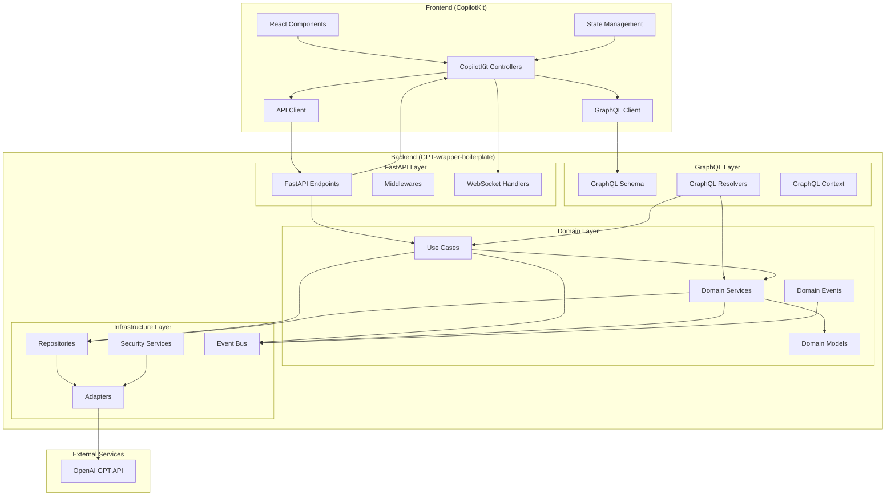

# CopilotKit Integration Architecture

This document outlines the architectural approach for integrating the CopilotKit frontend with the GPT-wrapper-boilerplate backend.

## Architecture Diagram

## Communication Flows

### 1. Frontend to Backend Communication

1. **GraphQL Data Access:**
   - Frontend components query data through GraphQL client
   - Requests are handled by GraphQL resolvers
   - Resolvers interact with domain use cases and services
   - Results are returned in structured GraphQL format

2. **Streaming Responses:**
   - Chat completions use FastAPI endpoints with streaming support
   - WebSocket connections maintain real-time bidirectional communication
   - Server-Sent Events (SSE) deliver continuous updates to the client

3. **Authentication Flow:**
   - JWT-based authentication for all API endpoints
   - Token verification middleware in both GraphQL and FastAPI layers
   - Role-based access control for different API operations

### 2. Backend Processing Flow

1. **Request Processing:**
   - Incoming requests validated by controllers/resolvers
   - Requests routed to appropriate use cases
   - Domain services manage business logic
   - Events published for asynchronous operations

2. **Response Generation:**
   - GPT API calls handled through infrastructure adapters
   - Streaming responses chunked and delivered to client
   - Response data cached when appropriate
   - Failures handled with clear error messages

## Component Responsibilities

### Frontend Components

- **CopilotKit Chat UI**: Provides user interface for chat interactions
- **GraphQL Client**: Manages structured data requests
- **API Client**: Handles streaming and real-time communications
- **React Components**: Custom UI elements specific to application
- **State Management**: Manages frontend application state

### Backend Components

#### GraphQL Layer
- **Schema**: Defines type system for data exchange
- **Resolvers**: Implements query and mutation handlers
- **Context**: Manages per-request context (auth, user data)

#### FastAPI Layer
- **Endpoints**: REST API endpoints for streaming
- **CopilotKit Controllers**: Dedicated controllers for CopilotKit integration
- **Middlewares**: Request processing middleware (auth, logging)
- **WebSocket Handlers**: Manages WebSocket connections

#### Domain Layer
- **Use Cases**: Application-specific business logic
- **Domain Services**: Reusable domain logic
- **Domain Models**: Core business entities
- **Domain Events**: State change notifications

#### Infrastructure Layer
- **Adapters**: Integrations with external systems
- **Repositories**: Data access implementations
- **Security Services**: Authentication/authorization
- **Event Bus**: Async communication backbone

## Security Considerations

1. **Authentication**: JWT-based authentication with proper expiration
2. **Authorization**: Role-based access control for all operations
3. **Data Protection**: Encryption for sensitive data at rest and in transit
4. **Rate Limiting**: Protection against abuse and DoS attacks
5. **Input Validation**: Thorough validation of all inputs
6. **Output Sanitization**: Prevent injection and XSS attacks

## Performance Considerations

1. **Caching Strategy**: Cache responses where appropriate
2. **Connection Pooling**: Efficient database connection management
3. **Asynchronous Processing**: Non-blocking I/O for APIs
4. **Chunked Streaming**: Optimize streaming for better UX
5. **Query Optimization**: Efficient GraphQL queries to minimize overhead

## Key Design Decisions

1. **Dual API Approach**: Using both GraphQL and REST/WebSocket APIs provides the best of both worlds - structured data queries and efficient streaming.

2. **Clear Layer Separation**: Maintaining clean separation between layers ensures maintainability and testability.

3. **Domain-Driven Design**: Following DDD principles keeps business logic isolated from technical concerns.

4. **Event-Driven Architecture**: Using events for asynchronous workflows improves scalability.

5. **Security-First Approach**: Implementing comprehensive security measures at all layers.

## Detailed Descriptions of Each Component and Their Interactions

### Frontend Components

- **CopilotKit Chat UI**: This component provides the user interface for chat interactions. It leverages CopilotKit's pre-built UI elements to create a seamless chat experience.
- **GraphQL Client**: Manages structured data requests from the frontend to the backend. It handles queries and mutations, ensuring data consistency and integrity.
- **API Client**: Handles streaming and real-time communications between the frontend and backend. It supports WebSocket connections for real-time updates and Server-Sent Events (SSE) for continuous data streams.
- **React Components**: Custom UI elements specific to the application. These components are built using React and are designed to be reusable and modular.
- **State Management**: Manages the frontend application state using a state management library (e.g., Redux, MobX). It ensures that the application state is consistent and predictable.

### Backend Components

#### GraphQL Layer
- **Schema**: Defines the type system for data exchange between the frontend and backend. It specifies the structure of the data and the relationships between different types.
- **Resolvers**: Implements the query and mutation handlers for the GraphQL API. Resolvers are responsible for fetching data from the database, processing it, and returning it to the client.
- **Context**: Manages the per-request context, including authentication and user data. It provides a way to pass information between different parts of the application during a request.

#### FastAPI Layer
- **Endpoints**: REST API endpoints for streaming responses and other external communications. These endpoints handle incoming HTTP requests and return appropriate responses.
- **CopilotKit Controllers**: Dedicated controllers for handling CopilotKit-specific requests. These controllers manage the interaction between the CopilotKit frontend and the backend services.
- **Middlewares**: Request processing middleware for tasks such as authentication, logging, and error handling. Middlewares are executed in the order they are added and can modify the request and response objects.
- **WebSocket Handlers**: Manages WebSocket connections for real-time communication between the frontend and backend. WebSocket handlers handle events such as connection establishment, message reception, and connection closure.

#### Domain Layer
- **Use Cases**: Application-specific business logic that defines how the application should behave in different scenarios. Use cases are responsible for coordinating the interaction between different domain services and models.
- **Domain Services**: Reusable domain logic that encapsulates business rules and policies. Domain services are used by use cases to perform complex operations that involve multiple domain models.
- **Domain Models**: Core business entities that represent the state and behavior of the application. Domain models are designed to be rich in behavior and encapsulate the business logic related to their state.
- **Domain Events**: State change notifications that are published when significant events occur in the domain. Domain events are used to decouple different parts of the system and enable event-driven communication.

#### Infrastructure Layer
- **Adapters**: Integrations with external systems such as databases, APIs, and messaging systems. Adapters implement the interfaces defined in the application layer's ports and translate data between the application and external systems.
- **Repositories**: Data access implementations that provide a way to store and retrieve data from databases. Repositories abstract the underlying data storage mechanism and provide a consistent interface for data access.
- **Security Services**: Authentication and authorization services that manage user access and permissions. Security services ensure that only authorized users can access certain parts of the application.
- **Event Bus**: An asynchronous communication backbone that enables different parts of the system to communicate through events. The event bus decouples the sender and receiver of events, allowing for more flexible and scalable communication.

## Conclusion

The integration of CopilotKit with the GPT-wrapper-boilerplate backend follows a well-defined architecture that ensures maintainability, scalability, and security. By leveraging both GraphQL and REST/WebSocket APIs, the system provides a robust and flexible communication mechanism that supports both structured data queries and real-time streaming. The clear separation of concerns between different layers and the use of domain-driven design principles further enhance the maintainability and testability of the system. The comprehensive security measures and performance optimizations ensure that the system is ready for production use.
